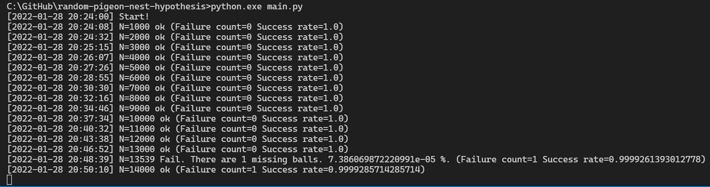

# random-pigeon-nest-hypothesis

うそ数学（＾～＾） ランダムでの鳩の巣仮説（＾～＾）

## 問題

わたしのイラストを元に Yさんに書いてもらった問題文:  

```plain
問題）箱からくじを引く。くじには1からNまでの数字（整数）が書かれている。くじは、一回ごとに箱に戻すものとする。
このくじ引きをx回行ったときにa（定数）以上の確率ですべての数字のくじが1回は出ていて欲しい。xをNとaを用いて表せ。
```

## わたしの回答

```plain
a = 2 * pi * e
x = N a
```

日本語難しいんで Pythonコードで示す。 理屈はお絵描き中。  

```shell
# Windows
python.exe main.py
```

### 精度

数学ではないからか、精度で見てみるぜ（＾～＾）  

  

```plain
Microsoft Windows [Version 10.0.19043.1466]
(c) Microsoft Corporation. All rights reserved.

C:\GitHub\random-pigeon-nest-hypothesis>python.exe main.py
[2022-01-28 22:42:45] Start!
[2022-01-28 22:42:53] N=1000 ok (Failure count=0 Success rate=1.0)
[2022-01-28 22:43:16] N=2000 ok (Failure count=0 Success rate=1.0)
[2022-01-28 22:43:57] N=3000 ok (Failure count=0 Success rate=1.0)
[2022-01-28 22:44:47] N=4000 ok (Failure count=0 Success rate=1.0)
[2022-01-28 22:46:06] N=5000 ok (Failure count=0 Success rate=1.0)
[2022-01-28 22:47:32] N=6000 ok (Failure count=0 Success rate=1.0)
[2022-01-28 22:49:08] N=7000 ok (Failure count=0 Success rate=1.0)
[2022-01-28 22:50:52] N=8000 ok (Failure count=0 Success rate=1.0)
[2022-01-28 22:53:21] N=9000 ok (Failure count=0 Success rate=1.0)
[2022-01-28 22:56:04] N=10000 ok (Failure count=0 Success rate=1.0)
[2022-01-28 22:58:57] N=11000 ok (Failure count=0 Success rate=1.0)
[2022-01-28 23:01:55] N=12000 ok (Failure count=0 Success rate=1.0)
[2022-01-28 23:05:00] N=13000 ok (Failure count=0 Success rate=1.0)
[2022-01-28 23:08:12] N=14000 ok (Failure count=0 Success rate=1.0)
[2022-01-28 23:09:01] N=14242 Fail. There are 1 missing balls. (Failure count=1 Success rate=0.9999297851425362)
[2022-01-28 23:11:35] N=15000 ok (Failure count=1 Success rate=0.9999333333333333)
[2022-01-28 23:15:06] N=16000 ok (Failure count=1 Success rate=0.9999375)
[2022-01-28 23:15:44] N=16176 Fail. There are 1 missing balls. (Failure count=2 Success rate=0.9998763600395648)
[2022-01-28 23:18:33] N=16776 Fail. There are 1 missing balls. (Failure count=3 Success rate=0.9998211731044349)
[2022-01-28 23:19:44] N=17000 ok (Failure count=3 Success rate=0.9998235294117647)
[2022-01-28 23:20:33] N=17155 Fail. There are 1 missing balls. (Failure count=4 Success rate=0.9997668318274555)
[2022-01-28 23:25:13] N=18000 ok (Failure count=4 Success rate=0.9997777777777778)
[2022-01-28 23:30:26] N=18941 Fail. There are 1 missing balls. (Failure count=5 Success rate=0.9997360223853017)
[2022-01-28 23:30:45] N=19000 ok (Failure count=5 Success rate=0.9997368421052631)
[2022-01-28 23:33:26] N=19477 Fail. There are 1 missing balls. (Failure count=6 Success rate=0.9996919443446116)
[2022-01-28 23:36:26] N=20000 ok (Failure count=6 Success rate=0.9997)
[2022-01-28 23:42:10] N=21000 ok (Failure count=6 Success rate=0.9997142857142857)
[2022-01-28 23:43:08] N=21162 Fail. There are 1 missing balls. (Failure count=7 Success rate=0.9996692184103582)
[2022-01-28 23:48:06] N=22000 ok (Failure count=7 Success rate=0.9996818181818182)
[2022-01-28 23:50:06] N=22351 Fail. There are 1 missing balls. (Failure count=8 Success rate=0.9996420741801262)
[2022-01-28 23:53:56] N=23000 ok (Failure count=8 Success rate=0.9996521739130435)
[2022-01-28 23:59:57] N=24000 ok (Failure count=8 Success rate=0.9996666666666667)
[2022-01-29 00:05:18] N=24866 Fail. There are 1 missing balls. (Failure count=9 Success rate=0.9996380600016086)
[2022-01-29 00:06:07] N=25000 ok (Failure count=9 Success rate=0.99964)
[2022-01-29 00:12:24] N=26000 ok (Failure count=9 Success rate=0.9996538461538461)
[2022-01-29 00:18:51] N=27000 ok (Failure count=9 Success rate=0.9996666666666667)
[2022-01-29 00:22:04] N=27492 Fail. There are 1 missing balls. (Failure count=10 Success rate=0.9996362578204568)
[2022-01-29 00:23:03] N=27642 Fail. There are 1 missing balls. (Failure count=11 Success rate=0.9996020548440778)
[2022-01-29 00:23:48] N=27758 Fail. There are 1 missing balls. (Failure count=12 Success rate=0.9995676921968442)
[2022-01-29 00:25:25] N=28000 ok (Failure count=12 Success rate=0.9995714285714286)
[2022-01-29 00:31:49] N=28980 Fail. There are 1 missing balls. (Failure count=13 Success rate=0.999551414768806)
[2022-01-29 00:31:58] N=29000 ok (Failure count=13 Success rate=0.999551724137931)
[2022-01-29 00:33:38] N=29251 Fail. There are 1 missing balls. (Failure count=14 Success rate=0.9995213838843117)
[2022-01-29 00:35:26] N=29518 Fail. There are 1 missing balls. (Failure count=15 Success rate=0.9994918354902094)
[2022-01-29 00:38:38] N=29994 Fail. There are 1 missing balls. (Failure count=16 Success rate=0.9994665599786624)
[2022-01-29 00:38:41] N=30000 ok (Failure count=16 Success rate=0.9994666666666666)
[2022-01-29 00:39:28] N=30117 Fail. There are 1 missing balls. (Failure count=17 Success rate=0.9994355347478169)
[2022-01-29 00:44:35] N=30868 Fail. There are 1 missing balls. (Failure count=18 Success rate=0.9994168718413892)
[2022-01-29 00:45:31] N=31000 ok (Failure count=18 Success rate=0.9994193548387097)
[2022-01-29 00:48:45] N=31464 Fail. There are 1 missing balls. (Failure count=19 Success rate=0.9993961352657005)
[2022-01-29 00:50:03] N=31652 Fail. There are 1 missing balls. (Failure count=20 Success rate=0.9993681283963098)
[2022-01-29 00:52:30] N=32000 ok (Failure count=20 Success rate=0.999375)
[2022-01-29 00:52:42] N=32029 Fail. There are 1 missing balls. (Failure count=21 Success rate=0.9993443441880796)
[2022-01-29 00:53:53] N=32192 Fail. There are 1 missing balls. (Failure count=22 Success rate=0.9993166003976143)
[2022-01-29 00:58:54] N=32847 Fail. There are 1 missing balls. (Failure count=23 Success rate=0.9992997838463178)
[2022-01-29 01:00:27] N=33000 ok (Failure count=23 Success rate=0.9993030303030302)
[2022-01-29 01:10:52] N=34000 ok (Failure count=23 Success rate=0.9993235294117647)
[2022-01-29 01:13:21] N=34240 Fail. There are 1 missing balls. (Failure count=24 Success rate=0.9992990654205608)
[2022-01-29 01:21:16] N=35000 ok (Failure count=24 Success rate=0.9993142857142857)
[2022-01-29 01:25:11] N=35371 Fail. There are 1 missing balls. (Failure count=25 Success rate=0.9992932062989455)
[2022-01-29 01:31:53] N=36000 ok (Failure count=25 Success rate=0.9993055555555556)
[2022-01-29 01:42:28] N=37000 ok (Failure count=25 Success rate=0.9993243243243243)
[2022-01-29 01:52:28] N=37923 Fail. There are 1 missing balls. (Failure count=26 Success rate=0.9993144002320492)
[2022-01-29 01:53:18] N=38000 ok (Failure count=26 Success rate=0.9993157894736842)
[2022-01-29 02:04:15] N=39000 ok (Failure count=26 Success rate=0.9993333333333333)
[2022-01-29 02:15:20] N=40000 ok (Failure count=26 Success rate=0.99935)
[2022-01-29 02:26:35] N=41000 ok (Failure count=26 Success rate=0.9993658536585366)
[2022-01-29 02:37:27] N=41952 Fail. There are 1 missing balls. (Failure count=27 Success rate=0.9993564073226545)
[2022-01-29 02:37:59] N=42000 ok (Failure count=27 Success rate=0.9993571428571428)
[2022-01-29 02:38:19] N=42029 Fail. There are 1 missing balls. (Failure count=28 Success rate=0.9993337933331747)
[2022-01-29 02:49:24] N=43000 ok (Failure count=28 Success rate=0.9993488372093023)
[2022-01-29 03:00:56] N=44000 ok (Failure count=28 Success rate=0.9993636363636363)
[2022-01-29 03:04:50] N=44324 Fail. There are 1 missing balls. (Failure count=29 Success rate=0.999345726919953)
[2022-01-29 03:12:39] N=45000 ok (Failure count=29 Success rate=0.9993555555555556)
[2022-01-29 03:18:20] N=45486 Fail. There are 1 missing balls. (Failure count=30 Success rate=0.9993404564041684)
[2022-01-29 03:22:50] N=45866 Fail. There are 1 missing balls. (Failure count=31 Success rate=0.9993241180831117)
[2022-01-29 03:24:28] N=46000 ok (Failure count=31 Success rate=0.9993260869565217)
[2022-01-29 03:25:34] N=46093 Fail. There are 1 missing balls. (Failure count=32 Success rate=0.9993057514156163)
[2022-01-29 03:36:24] N=47000 ok (Failure count=32 Success rate=0.9993191489361702)
[2022-01-29 03:48:31] N=48000 Fail. There are 1 missing balls. (Failure count=33 Success rate=0.9993125)
[2022-01-29 03:50:06] N=48131 Fail. There are 1 missing balls. (Failure count=34 Success rate=0.9992935945648335)
[2022-01-29 03:55:37] N=48587 Fail. There are 1 missing balls. (Failure count=35 Success rate=0.9992796427027806)
[2022-01-29 03:56:36] N=48669 Fail. There are 1 missing balls. (Failure count=36 Success rate=0.9992603094372188)
[2022-01-29 04:00:36] N=49000 ok (Failure count=36 Success rate=0.999265306122449)
[2022-01-29 04:09:15] N=49702 Fail. There are 1 missing balls. (Failure count=37 Success rate=0.9992555631564122)
[2022-01-29 04:10:04] N=49769 Fail. There are 1 missing balls. (Failure count=38 Success rate=0.9992364725029637)
[2022-01-29 04:12:55] N=50000 ok (Failure count=38 Success rate=0.99924)
[2022-01-29 04:20:16] N=50595 Fail. There are 1 missing balls. (Failure count=39 Success rate=0.9992291728431664)
[2022-01-29 04:25:21] N=51000 ok (Failure count=39 Success rate=0.9992352941176471)
[2022-01-29 04:34:10] N=51702 Fail. There are 1 missing balls. (Failure count=40 Success rate=0.999226335538277)
[2022-01-29 04:36:19] N=51871 Fail. There are 1 missing balls. (Failure count=41 Success rate=0.9992095776059841)
[2022-01-29 04:37:56] N=52000 ok (Failure count=41 Success rate=0.9992115384615384)
[2022-01-29 04:37:58] N=52003 Fail. There are 1 missing balls. (Failure count=42 Success rate=0.9991923542872526)
[2022-01-29 04:39:15] N=52103 Fail. There are 1 missing balls. (Failure count=43 Success rate=0.9991747116288889)
[2022-01-29 04:48:54] N=52867 Fail. There are 1 missing balls. (Failure count=44 Success rate=0.9991677227760228)
[2022-01-29 04:50:36] N=53000 ok (Failure count=44 Success rate=0.9991698113207547)
[2022-01-29 04:55:03] N=53349 Fail. There are 1 missing balls. (Failure count=45 Success rate=0.9991564977787775)
[2022-01-29 04:57:38] N=53553 Fail. There are 1 missing balls. (Failure count=46 Success rate=0.9991410378503539)
[2022-01-29 05:03:18] N=54000 ok (Failure count=46 Success rate=0.9991481481481481)
[2022-01-29 05:12:22] N=54703 Fail. There are 1 missing balls. (Failure count=47 Success rate=0.9991408149461638)
[2022-01-29 05:12:29] N=54712 Fail. There are 1 missing balls. (Failure count=48 Success rate=0.9991226787542038)
[2022-01-29 05:13:45] N=54813 Fail. There are 1 missing balls. (Failure count=49 Success rate=0.999106051484137)
[2022-01-29 05:16:13] N=55000 ok (Failure count=49 Success rate=0.999109090909091)
[2022-01-29 05:21:08] N=55372 Fail. There are 1 missing balls. (Failure count=50 Success rate=0.9990970165426569)
[2022-01-29 05:27:02] N=55819 Fail. There are 1 missing balls. (Failure count=51 Success rate=0.9990863326107597)
[2022-01-29 05:29:27] N=56000 ok (Failure count=51 Success rate=0.9990892857142857)
[2022-01-29 05:30:42] N=56095 Fail. There are 1 missing balls. (Failure count=52 Success rate=0.9990730011587485)
[2022-01-29 05:34:48] N=56409 Fail. There are 1 missing balls. (Failure count=53 Success rate=0.9990604336187487)
[2022-01-29 05:42:38] N=57000 ok (Failure count=53 Success rate=0.9990701754385964)
[2022-01-29 05:44:31] N=57141 Fail. There are 1 missing balls. (Failure count=54 Success rate=0.9990549692865018)
[2022-01-29 05:53:44] N=57831 Fail. There are 1 missing balls. (Failure count=55 Success rate=0.9990489529836939)
[2022-01-29 05:56:00] N=58000 ok (Failure count=55 Success rate=0.9990517241379311)
[2022-01-29 06:09:30] N=59000 ok (Failure count=55 Success rate=0.9990677966101695)
[2022-01-29 06:12:35] N=59224 Fail. There are 1 missing balls. (Failure count=56 Success rate=0.9990544373902472)
[2022-01-29 06:14:47] N=59382 Fail. There are 1 missing balls. (Failure count=57 Success rate=0.9990401131656057)
[2022-01-29 06:23:15] N=60000 ok (Failure count=57 Success rate=0.99905)
[2022-01-29 06:23:25] N=60013 Fail. There are 1 missing balls. (Failure count=58 Success rate=0.999033542732408)
[2022-01-29 06:34:31] N=60812 Fail. There are 1 missing balls. (Failure count=59 Success rate=0.9990297967506413)
[2022-01-29 06:37:07] N=61000 ok (Failure count=59 Success rate=0.9990327868852459)
[2022-01-29 06:50:56] N=62000 ok (Failure count=59 Success rate=0.9990483870967742)
[2022-01-29 06:51:26] N=62036 Fail. There are 1 missing balls. (Failure count=60 Success rate=0.9990328196531046)
[2022-01-29 07:04:49] N=63000 ok (Failure count=60 Success rate=0.9990476190476191)
[2022-01-29 07:05:27] N=63047 Fail. There are 1 missing balls. (Failure count=61 Success rate=0.9990324678414516)
[2022-01-29 07:19:01] N=64000 ok (Failure count=61 Success rate=0.999046875)
[2022-01-29 07:19:08] N=64009 Fail. There are 1 missing balls. (Failure count=62 Success rate=0.999031386211314)
[2022-01-29 07:20:31] N=64107 Fail. There are 1 missing balls. (Failure count=63 Success rate=0.9990172680050541)
[2022-01-29 07:26:07] N=64502 Fail. There are 1 missing balls. (Failure count=64 Success rate=0.9990077827044123)
[2022-01-29 07:33:17] N=65000 ok (Failure count=64 Success rate=0.9990153846153846)
[2022-01-29 07:46:54] N=65814 Fail. There are 1 missing balls. (Failure count=65 Success rate=0.9990123681891391)
[2022-01-29 07:50:50] N=66000 ok (Failure count=65 Success rate=0.9990151515151515)
[2022-01-29 08:02:23] N=66561 Fail. There are 1 missing balls. (Failure count=66 Success rate=0.999008428358949)
[2022-01-29 08:11:34] N=67000 ok (Failure count=66 Success rate=0.9990149253731343)
[2022-01-29 08:21:26] N=67469 Fail. There are 1 missing balls. (Failure count=67 Success rate=0.9990069513406157)
[2022-01-29 08:25:14] N=67652 Fail. There are 1 missing balls. (Failure count=68 Success rate=0.9989948560279075)
[2022-01-29 08:31:01] N=67931 Fail. There are 1 missing balls. (Failure count=69 Success rate=0.9989842634437885)
[2022-01-29 08:32:29] N=68000 ok (Failure count=69 Success rate=0.998985294117647)
[2022-01-29 08:32:40] N=68008 Fail. There are 1 missing balls. (Failure count=70 Success rate=0.9989707093283143)
[2022-01-29 08:42:30] N=68477 Fail. There are 1 missing balls. (Failure count=71 Success rate=0.9989631555120697)
[2022-01-29 08:43:25] N=68520 Fail. There are 1 missing balls. (Failure count=72 Success rate=0.9989492119089317)
[2022-01-29 08:52:06] N=68933 Fail. There are 1 missing balls. (Failure count=73 Success rate=0.9989410006818215)
[2022-01-29 08:53:31] N=69000 ok (Failure count=73 Success rate=0.9989420289855072)
[2022-01-29 09:03:31] N=69479 Fail. There are 1 missing balls. (Failure count=74 Success rate=0.9989349299788425)
[2022-01-29 09:08:19] N=69705 Fail. There are 1 missing balls. (Failure count=75 Success rate=0.9989240370131267)
[2022-01-29 09:14:29] N=70000 ok (Failure count=75 Success rate=0.9989285714285714)
[2022-01-29 09:30:44] N=70769 Fail. There are 1 missing balls. (Failure count=76 Success rate=0.99892608345462)
[2022-01-29 09:34:01] N=70923 Fail. There are 1 missing balls. (Failure count=77 Success rate=0.998914315525288)
[2022-01-29 09:35:41] N=71000 ok (Failure count=77 Success rate=0.9989154929577465)
[2022-01-29 09:41:43] N=71284 Fail. There are 1 missing balls. (Failure count=78 Success rate=0.9989057853094664)
[2022-01-29 09:44:30] N=71415 Fail. There are 1 missing balls. (Failure count=79 Success rate=0.9988937898200658)
[2022-01-29 09:45:12] N=71447 Fail. There are 1 missing balls. (Failure count=80 Success rate=0.9988802888854675)
[2022-01-29 09:47:29] N=71553 Fail. There are 1 missing balls. (Failure count=81 Success rate=0.9988679719927885)
[2022-01-29 09:57:06] N=72000 ok (Failure count=81 Success rate=0.998875)
[2022-01-29 10:17:56] N=72961 Fail. There are 1 missing balls. (Failure count=82 Success rate=0.9988761118953962)
[2022-01-29 10:18:48] N=73000 ok (Failure count=82 Success rate=0.9988767123287671)
```

👆 「N=73000 ぐらいの小さな数を調べたところで意味なくて、 N が大きくなると ボールをもっと投げなければいけなくなるんだ」というのは本当か、というのが争点だぜ（＾～＾）  

## あるおじさんの回答

```plain
(1/N)^x * (x!/((x-N)!)) > a
x を a の式で表すのは難しくて私の数学力では無理
```

なんかすごい式だぜ（＾～＾） 階乗を見ただけでページをそっと閉じたくなる……（＾～＾）  
